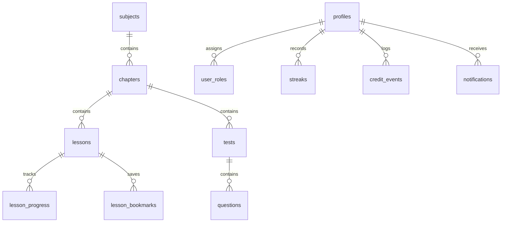

# Easy Padhai — Master Project Blueprint & Architecture Single Source of Truth (SSOT)

> **Document Status**: Active / Authoritative  
> **Last Updated**: October 2026  
> **App Version**: TanStack Start + Vite + Supabase + Cloudflare R2  
> **Audience**: Principal Architects, Software Engineers, and AI Pair-Programming Agents.

---

## 1. Production Infrastructure & Verified Resources

### 1.1 Live Production Environments
- **Production URL**: [https://ep.studytube.co.in](https://ep.studytube.co.in)
- **Hosting Platform**: Vercel (Production deployment linked directly to GitHub `main` branch).
- **Deployment Pipeline**: Automatic CI/CD deployment on every push to `origin main`.
- **Local Build Verification Command**:
  ```powershell
  $env:VERCEL="1"; npm run build
  ```
  *(Note: Must succeed in under ~30 seconds with 0 TypeScript/Vite errors before pushing).*

### 1.2 Version Control & Source Code
- **Repository URL**: `https://github.com/riteshneha2011-commits/easy-padhai.git`
- **Primary Branch**: `main`
- **GitHub Push Protection**: **STRICTLY ACTIVE**. Any attempt to commit raw secret keys (e.g. Supabase Service Role Key, Gemini API key, R2 secrets) will be instantly rejected by GitHub. Secrets must **only** reside in `.env` and Vercel Environment Variables.

### 1.3 Cloud Providers & Connections
| Service | Resource Name / ID | Endpoint / Domain | Configuration Location |
| :--- | :--- | :--- | :--- |
| **Supabase** (DB & Auth) | `bykqlnoftmqclyrtjiyp` | `https://bykqlnoftmqclyrtjiyp.supabase.co` | `.env` (`VITE_SUPABASE_URL`, `SUPABASE_SERVICE_ROLE_KEY`) |
| **Cloudflare R2** (Media) | `easypadhai-media` | `https://pub-5b335ec07c414198abab2b3fd75d60cd.r2.dev` | `.env` (`R2_ACCESS_KEY_ID`, `R2_SECRET_ACCESS_KEY`) |
| **Google Gemini AI** | Google AI Studio | API Endpoint | `.env` (`GEMINI_API_KEY`) |

> ⚠️ **CRITICAL DIRECTIVE ON SUPABASE MCP:**  
> **NEVER use Supabase MCP tools in this workspace.**  
> The Supabase MCP server is linked to an outdated, dead test project (`sfjkhwauadkomcesyobb`). Any queries run through MCP will target the wrong database. Always verify or query the database using direct Node.js scripts via `@supabase/supabase-js` reading from `.env`.

### 1.4 Active CI/CD Workflows & Background Automation
- **Supabase Keep-Alive Automation** (`.github/workflows/supabase-keep-alive.yml`):
  - **Schedule**: Every 3 days at 05:00 UTC (10:30 AM IST) via GitHub Actions cloud runner.
  - **Purpose**: Pings the Supabase REST API (`/rest/v1/subjects?select=id&limit=1`) to prevent Supabase Free Tier projects from automatically pausing due to 7 days of inactivity.
  - **Manual Trigger**: Supports `workflow_dispatch` for on-demand health testing.

---

## 2. Project Soul & Golden Directives (Core Working Rules)

### 2.1 Communication Language Protocol
- **User Conversation**: The user communicates in Hindi / Hinglish. Responses must be delivered in clear, respectful, professional Hindi / Hinglish.
- **Codebase Artifacts**: All code, TypeScript types, database migrations, comments, identifiers, commit messages, and internal architecture documentation must remain in standard, idiomatic English.
- **UI Copy**: User-facing UI copy follows an intuitive bilingual mix appropriate for Indian CBSE students (e.g., clear Hindi prompts for exam preparation, bilingual subject titles where applicable, and clean English navigation).

### 2.2 User Permission Protocol
- **Architectural Changes**: Always discuss and propose the architectural plan, root-cause diagnosis, and recommended solution before making drastic changes.
- **Data Mutability**: Never delete, truncate, or run bulk mutations on live database tables without explicit user consent.
- **Preserve Working Features**: Enhancing one feature must never break existing working systems (e.g., audio podcast mode, offline player, streaks, authentication).

### 2.3 Domain Truth Protocol
- **Zero Fabrication**: Never guess database IDs, fabricate fictitious curriculum records, or assume table structures.
- **Empirical Verification**: Always verify data by executing isolated Node.js verification scripts (e.g., `scripts/check_db.mjs`) against the real database.

### 2.4 Git & Code Hygiene
- **Pre-Commit Verification**: Run `$env:VERCEL="1"; npm run build` before committing.
- **Atomic Commits**: Create small, well-described commits with semantic prefixes (`fix:`, `feat:`, `refactor:`, `perf:`, `ci:`).
- **No Secret Leaks**: Never put plaintext secret tokens in commit logs or markdown files.

---

## 3. Database Architecture & Critical Performance Safeguards

### 3.1 Core Table Schemas & Relationships


1. **`subjects`**: Core academic courses (Class 9 to 12). Fields: `id`, `name`, `slug`, `class_level` (9-12), `order_index`, `published`.
2. **`chapters`**: Units inside subjects. Fields: `id`, `subject_id`, `title`, `slug`, `order_index`, `published`.
3. **`lessons`**: Content units. Fields: `id`, `chapter_id`, `title`, `kind` (`audio` | `video` | `summary` | `pdf`), `audio_url`, `video_url`, `pdf_url`, `summary`, `duration_minutes`, `order_index`, `published`.
4. **`tests`**: Chapter-level tests or lesson-specific quizzes. Fields: `id`, `chapter_id`, `title`, `description` (e.g. `lesson:<lesson_id>`), `duration_minutes`, `published`.
5. **`questions`**: Objective test items (1,350+ records). Fields: `id`, `test_id`, `prompt`, `options` (JSON string array), `correct_index`, `explanation`, `difficulty`, `order_index`.
6. **`notifications`**: Targeted alerts. Fields: `id`, `title`, `message`, `action_url`, `target_class`, `target_subject_id`, `type` (`lecture` | `broadcast` | `chapter`), `created_at`.
7. **`user_roles`**: Authorization mapping. Fields: `user_id`, `role` (`student` | `teacher` | `admin`).
8. **`profiles`**, **`streaks`**, **`credit_events`**, **`lesson_progress`**: Gamification and learning analytics.

### 3.2 Known Performance Pitfalls & Critical Safeguards

#### ⚠️ Pitfall 1: PostgREST 1,000-Row Hard Limit (DO NOT REVERT)
- **The Issue**: Supabase PostgREST imposes a default cap of 1,000 rows per query. The `questions` table already holds **1,350+ items**.
- **Dangerous Anti-Pattern**:
  ```ts
  // ❌ NEVER DO THIS: Will truncate at 1,000 rows; all tests created recently get 0 questions!
  const { data: questions } = await supabaseAdmin.from("questions").select("id, test_id");
  ```
- **Mandatory Pattern**:
  ```ts
  // ✅ ALWAYS USE NESTED RELATIONAL JOINS:
  const { data: tests } = await supabaseAdmin
    .from("tests")
    .select("*, questions(id)")
    .order("created_at", { ascending: false });
  // questionCount = Array.isArray(t.questions) ? t.questions.length : 0
  ```

#### ⚠️ Pitfall 2: Service Worker Caching of Dynamic Server Functions
- **The Issue**: TanStack Start handles server function RPC calls over HTTP GET at `/_server?_serverFnId=...`.
- **Dangerous Anti-Pattern**: Allowing the Service Worker to match and cache `/_server` requests causes client PWAs to serve stale curriculum and notification data for days.
- **Mandatory Policy** (`public/sw.js`):
  - Service Worker `v11+` strictly bypasses `/_server`, `/api`, `_serverFnId`, `_data`, `supabase.co`, and `r2.dev`.
  - Static caching is restricted strictly to actual static assets (JS chunks, CSS, fonts, audio, images).

#### ⚠️ Pitfall 3: Client Cache Staleness on App Launch
- **Policy**: `useRealtimeContentSync` in `src/hooks/use-realtime-content.ts` triggers immediate query invalidation for `["catalog"]` and `["my-notifications"]` upon app mount and on window focus/visibility transitions.

---

## 4. Domain-Specific Business Logic & Historical Rules

### 4.1 Curriculum Hierarchy & Navigation Flow
- Structure: **Class Level (9–12) ➔ Subject ➔ Chapter ➔ Lesson ➔ Quiz/Test**.
- When navigating to `/learn`, learners are filtered by their active class preference (`useActiveClass`).

### 4.2 Drip / Scheduled Content System (`src/lib/schedule.ts`)
- Scheduled content metadata is cleanly embedded using the tag:
  ```html
  <!--SCHEDULED:2026-10-15T04:30:00.000Z-->
  ```
- **IST Timezone Anchor**: Cloud servers (Vercel) run in UTC, while students and teachers operate in India Standard Time (`Asia/Kolkata`, UTC+05:30). `schedule.ts` explicitly anchors all input dates to IST (+05:30) to prevent date-picker shifting.
- Future-dated lessons and notifications are hidden from students until their release time arrives.

### 4.3 Podcast Mode & Continuous Playback (`src/components/media-player.tsx`)
- **Continuous Playlist**: Plays through chapter lessons automatically.
- **Lock Screen Media Session API**: Uses `navigator.mediaSession` to provide play/pause, seek, next-track, and previous-track controls with chapter artwork on mobile lock screens.
- **Transition Audio Announcements**: Audio notifications alert students when transitioning to the next lesson or next chapter.

---

## 5. Codebase & Component Directory Map

```
Easy Padhai/
├── public/                     # Static assets, PWA manifest, offline.html, sw.js (v11)
├── scripts/                    # Verified operational scripts (check_db.mjs, keep_alive.mjs)
├── .github/workflows/          # GitHub Actions CI/CD (supabase-keep-alive.yml)
├── src/
│   ├── components/             # Reusable UI Components
│   │   ├── ui/                 # Radix UI + Tailwind design primitives
│   │   ├── media-player.tsx    # Audio/Video player with Podcast mode & MediaSession
│   │   ├── site-header.tsx     # Global navigation, class switcher, user profile
│   │   ├── notification-bell.tsx # Realtime student notification drawer
│   │   ├── podcast-mode-dialog.tsx # Dedicated audio immersion modal
│   │   └── install-pwa-button.tsx  # PWA installation banner & trigger
│   ├── hooks/                  # Custom React Hooks
│   │   ├── use-active-class.ts # Student class state (Class 9-12 switcher)
│   │   ├── use-auth.tsx        # Supabase auth state & session listener
│   │   ├── use-realtime-content.ts # WebSocket listener & visibility revalidator
│   │   └── use-study-heartbeat.ts  # Study time tracker & analytics
│   ├── lib/                    # Core Business Services & Functions
│   │   ├── admin.server.ts     # Staff assertions, catalog fetch, upsert logic
│   │   ├── admin.functions.ts  # TanStack Start server function wrappers
│   │   ├── content.server.ts   # Public curriculum fetch & aggregation
│   │   ├── notifications.server.ts # Notification dispatch, schedule parser
│   │   ├── schedule.ts         # IST date conversion & scheduled release tags
│   │   ├── r2.server.ts        # Cloudflare R2 S3 presigned upload handler
│   │   └── db.server.ts        # Supabase public & service role clients
│   └── routes/                 # File-based Routes (TanStack Router)
│       ├── __root.tsx          # Root layout, providers, SW registration
│       ├── index.tsx           # Home landing page
│       ├── learn.index.tsx     # Curriculum browser (/learn)
│       ├── learn.$slug.tsx     # Chapter detail & lesson viewer (/learn/:slug)
│       ├── test.$testId.tsx    # Interactive objective quiz runner
│       ├── teach.tsx           # Teacher & Admin Studio (/teach)
│       ├── admin.tsx           # Owner Admin Dashboard (/admin)
│       └── dashboard.tsx       # Student progress, streaks & stats
```

---

## 6. Decision Log & Resolved Bug History (DO NOT REVERT)

| Bug ID / Decision | Problem Description | Root Cause | Permanent Fix (DO NOT REVERT) |
| :--- | :--- | :--- | :--- |
| **DEC-001** | Quizzes showed `0 Questions` on `/teach` Tab 3 | PostgREST capped `questions.select("id, test_id")` at 1,000 rows. DB has 1,350+ questions. | Query `tests` with nested `questions(id)`: `supabaseAdmin.from("tests").select("*, questions(id)")`. |
| **DEC-002** | New lectures failed to appear for users on installed PWA | Service Worker `v10` intercepted and cached `/_server` data queries as static assets. | Upgraded SW to `v11`. Explicitly bypassed `/_server`, `/api`, and dynamic endpoints. Added mount invalidation in `useRealtimeContentSync`. |
| **DEC-003** | Missing notifications when admin published lectures | Frontend notification call was decoupled from backend `upsertLesson`. | Added automatic server-side notification generation inside `upsertLesson` in `admin.server.ts` with deduplication. |
| **DEC-004** | Scheduled release times shifted by 5.5 hours | Server UTC timezone distorted local date-picker strings. | Implemented `schedule.ts` with explicit `+05:30` (IST) normalization. |
| **DEC-005** | Supabase MCP connection errors | Supabase MCP server points to an inactive test project (`sfjkhwauadkomcesyobb`). | **STRICT PROHIBITION**: Do not use Supabase MCP. Use direct Node.js scripts and `.env` credentials. |
| **DEC-006** | Supabase Free Tier auto-pause after 7 days | Inactive projects on Supabase free tier pause if no queries occur. | Created `.github/workflows/supabase-keep-alive.yml` to ping database every 3 days. |

---

## 7. New Session / AI Agent Quick Onboarding Checklist

When starting a new session on this repository, complete these 5 steps before writing code:

1. **Check Credentials & Prohibitions**:
   - Verify `.env` has valid credentials.
   - **DO NOT invoke Supabase MCP tools**. Refer to `PROJECT_CONNECTIONS.md`.
2. **Review Resolved Bugs (Section 6)**:
   - Ensure your proposed change does not re-introduce known pitfalls (such as PostgREST 1000-row limits or SW caching bugs).
3. **Propose Before Executing**:
   - Present the diagnosis and architectural strategy to the user in Hindi/Hinglish. Obtain approval before applying edits.
4. **Preserve Working Features**:
   - Verify that Audio Podcast Mode, Offline Player, and Class 9-12 Switcher remain intact.
5. **Run Clean Build Verification**:
   - Before committing and pushing:
     ```powershell
     $env:VERCEL="1"; npm run build
     ```
   - Verify that the build succeeds with 0 errors.
